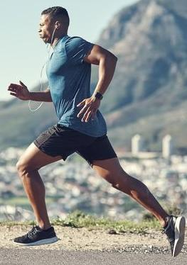
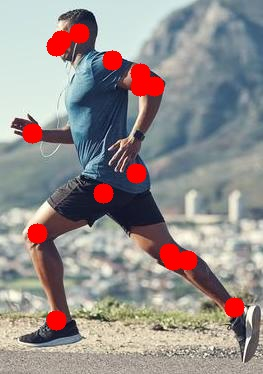
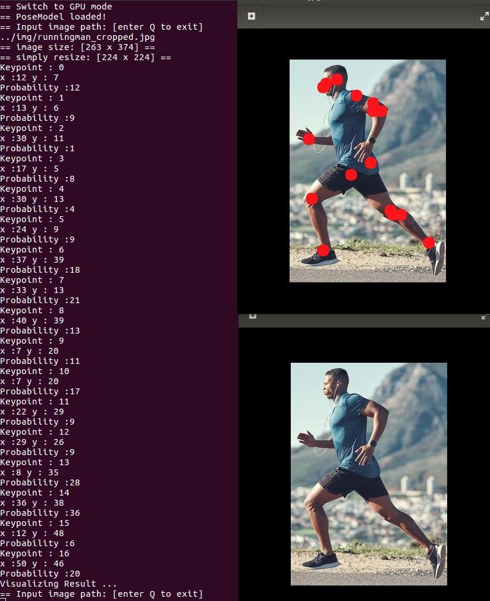

Some Update on 19/2/2020:
If you are still using this code, there are something wrong:
1. The model should have input (W*H) 256*320 instead of 224*224 which i have changed it in my new repo (MPPE), which making the accuracy bad.
2. The way I use loop to calculate the keypoints requires me to convert the tensor using tensor.item() which waste a hell ton of time , consider using: (ps also written in MPPE)

         auto ft = output_tensor.flatten(2,3); //flattening
         auto maxresult = at::max(ft,2); //find the coordinate with the highest confidence
         auto maxid = std::get<1>(maxresult); //get the tensor                                           
                
         for(int kpts=0;kpts<17;kpts++){
            int i = 0;
            i = (int)(maxid[personid][kpts].item().toFloat()) ;
            max_x = (i % 64)+1;
            max_y = (i / 64)+1;
            coor[kpts][0] = max_x ;
            coor[kpts][1] = max_y ;
            }                                            
            
This demo shows you how to build a single pose estimation algorithm using libtorch

The model is trained using pytorch (Alphapose's SPPE model) , Check their github for training the model

## Contents

1. [Requirements](#requirements)
2. [Build](#build)
3. [Usage](#usage)


## Requirements

- Pytorch 
- Libtorch
- OpenCV

## Build

### Step 1

Download the model via this link:

https://drive.google.com/file/d/1xEQnogxHAkurNebHGatHzZvkN7N8khtt/view?usp=sharing

Put the model "duc_se.pth" into the file directory: 

"models/sppe"


### Step 2

Take a look at ``prediction.cpp`` to see how estimation is done

- run ``model_trace.py``,   then you will get a file ``posemodel.pt``
- compile your cpp program by ``-DCMAKE_PREFIX_PATH=/absolute/path/to/libtorch``, for example:

```
mkdir build
cd build
cmake -DCMAKE_PREFIX_PATH=/home/luisrodman/libtorch ..
make
```

- test your program

``SPPE <path-to-posemodel.pt>``

```
== Switch to GPU mode
== PoseModel loaded!
== Input image path: [enter Q to exit]
../img/runningman_cropped.jpg
== image size: [263 x 374] ==
== simply resize: [224 x 224] ==
Keypoint : 0
x :12 y : 7
Probability :12
Keypoint : 1
x :13 y : 6
Probability :9
Keypoint : 2
x :30 y : 11
Probability :1
Keypoint : 3
x :17 y : 5
Probability :8
Keypoint : 4
x :30 y : 13
Probability :4
Keypoint : 5
x :24 y : 9
Probability :9
Keypoint : 6
x :37 y : 39
Probability :18
Keypoint : 7
x :33 y : 13
Probability :21
Keypoint : 8
x :40 y : 39
Probability :13
Keypoint : 9
x :7 y : 20
Probability :11
Keypoint : 10
x :7 y : 20
Probability :17
Keypoint : 11
x :22 y : 29
Probability :9
Keypoint : 12
x :29 y : 26
Probability :9
Keypoint : 13
x :8 y : 35
Probability :28
Keypoint : 14
x :36 y : 38
Probability :36
Keypoint : 15
x :12 y : 48
Probability :6
Keypoint : 16
x :50 y : 46
Probability :20
Visualizing Result ...


```







